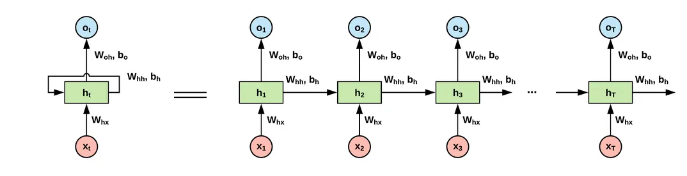

# LLM to ChatBot

## Index
- 1 réseau de neurones 
- 2 architecture / mode de connexion
- 3 mécanisme d'attention
- 4 implémentation 
    - 4.1 -modélisation de la problématique
    - 4.2  programmation 
- 5 problématiques annexes (mémoire, rag, brms)

## Réseau de neurones 

### Le perceptron ou threshold logic unit / TLU


$$ y = step(\sum_{i=1}^n w_i \cdot x_i+b) $$

Où $y$ est la sortie binaire (0 ou 1), $w_i$ sont les poids, $x_i$ les entrées et $b$ ets le biais.

Fonction d'activation (Step function) :

$$ step(z) = \begin{cases} 0 & z < 0 \\ 1 & z \geq 0 \end{cases} $$

### Perceptron multicouche et rétro propagation


Un MLP est un réseau de neurones entièrement connecté, où chaque neurone d'une couche est connecté à chaque neurone de la couche suivante. Les MLP sont capables de modéliser des relations non linéaires grâce à l'utilisation de couches cachées et de fonctions d'activation non linéaires.

#### Formules

Pour chaque neurone de la couche cachée :
$$
h^{(1)}_j = \sigma\left(\sum_{i=1}^{n} w_{ij} \cdot x_i + b_j\right)
$$

Pour chaque neurone de la couche de sortie :
$$
y_k = \sigma\left(\sum_{j=1}^{m} w_{jk} \cdot h^{(1)}_j + b_k\right)
$$

Fonctions d'activation possibles :
- Sigmoid : $\sigma(z) = \frac{1}{1 + e^{-z}}$
- ReLU : $\sigma(z) = \max(0, z)$

#### Utilisation
Les MLPs sont utilisés pour des tâches de classification, de régression, et d'autres problèmes d'apprentissage supervisé nécessitant des données tabulaires.

# Convolutional Neural Networks (CNN)

## Description
Les CNN sont principalement utilisés pour le traitement d'images. Ils exploitent des filtres pour extraire des caractéristiques locales des données d'entrée. Les couches de convolution sont souvent suivies de couches de pooling pour réduire la dimensionnalité. 

Extraction de caractéristiques !


## Formules
### Convolution :
$$
h_{i,j}^{(l)} = \sigma\left(\sum_{m=1}^{M} \sum_{n=1}^{N} W_{m,n} \cdot x_{i+m-1,j+n-1} + b^{(l)}\right)
$$
### Pooling (max pooling) :
$$
h_{i,j}^{\text{pool}} = \max_{m,n} h_{i+m,j+n}
$$

## Utilisation
Les CNN sont couramment utilisés en reconnaissance d'images, en détection d'objets, et dans de nombreuses autres applications de vision par ordinateur.

# Recurrent Neural Networks (RNN)


## Description
Les RNN sont conçus pour traiter des séquences de données, telles que des séries temporelles ou du texte. Ils mémorisent les informations de la séquence précédente pour influencer les prédictions futures.

## Formules
$$
h_t = \sigma\left(W_h h_{t-1} + W_x x_t + b\right)
$$

## Utilisation
Les RNN sont utilisés pour le traitement de texte, les prévisions de séries temporelles, et les tâches nécessitant une compréhension séquentielle.

# Long Short-Term Memory (LSTM) et Gated Recurrent Unit (GRU)

## Description
Les LSTM et GRU sont des variantes des RNN qui permettent de mieux gérer les dépendances à long terme et d'atténuer les problèmes de gradient qui disparaît. Les LSTM utilisent des portes pour contrôler le flux d'informations dans la cellule de mémoire.


## Utilisation
Les LSTM et GRU sont utilisés dans la traduction automatique, la génération de texte, et d'autres applications nécessitant une mémoire à long terme.

# Autoencoders et Variational Autoencoders (VAE)

## Description
Les autoencoders sont des réseaux non supervisés qui apprennent à reconstruire leurs entrées après les avoir compressées en une représentation latente. Les VAEs sont une extension des autoencoders qui modélisent la distribution des données pour générer de nouvelles instances similaires.

## Formules
### Autoencoders :

Encodage : 
$$
z = \sigma\left(W_e \cdot x + b_e\right)
$$
Décodage : 
$$
\hat{x} = \sigma\left(W_d \cdot z + b_d\right)
$$
### VAE :

Encodage :
$$
\mu = f_\mu(x), \quad \log\sigma^2 = f_\sigma(x)
$$
Échantillonnage (Reparamétrisation) :
$$
z = \mu + \sigma \cdot \epsilon, \quad \epsilon \sim \mathcal{N}(0, 1)
$$
Décodage :
$$
\hat{x} = g(z)
$$
Perte totale :
$$
\text{Loss} = \text{Reconstruction Loss} + \text{KL Divergence}
$$

## Utilisation
Les autoencoders sont utilisés pour la réduction de dimension, la détection d'anomalies, et la génération de données synthétiques.

# Generative Adversarial Networks (GANs)

## Description
Les GANs sont des réseaux génératifs composés de deux réseaux opposés : un Générateur qui crée des données synthétiques et un Discriminateur qui essaie de distinguer ces données des vraies données. Les deux réseaux s'améliorent mutuellement au fil de l'entraînement.

## Formules
Perte du Discriminateur :
$$
\text{Loss}_{D} = -\left[\log(D(x)) + \log(1 - D(G(z)))\right]
$$
Perte du Générateur :
$$
\text{Loss}_{G} = -\log(D(G(z)))
$$

## Utilisation
Les GANs sont utilisés pour la génération d'images, la synthèse de données, la super-résolution, et la création de contenu réaliste.

# Deconvolutional Neural Networks (DNN)

## Description
Les réseaux de neurones déconvulsifs sont utilisés pour générer des images ou d'autres types de données à partir de représentations plus compactes, souvent en tant que partie des GANs.

## Formules
$$
y = \sigma\left(W^T \cdot x + b\right)
$$

## Utilisation
Les DNN sont utilisés dans la génération d'images, la super-résolution, et la segmentation d'images.

# Transformers

## Description
Les Transformers sont des architectures de traitement de séquences basées sur l'attention, permettant de modéliser les relations entre les éléments d'une séquence de manière plus efficace que les RNNs traditionnels.

Plusieurs architecture de transformer
- Encoder

- Decoder 

- Encoder-Decoder 

Dans le cadre des LLM les plus utilisés sont les architecture Decoder la différence fondamentale se situe dans le calcule de la matrice d’attention.


Masked Multi-Head Attention :


A l'aide d'une matrice 

``` python 
    masked = [
        [1, -inf, -inf, -inf],
        [1,  1  , -inf, -inf],
        [1,  1  ,  1  , -inf],
        [1,  1  ,  1  ,  1  ]
    ]
```


Architecture Decoder unidirectionnelle. Il s'agit d'un réseau dense multicouche avec une couche de multi-head attention pour le calcul de l'attention.


## Formules
Mécanisme d'attention :
$$
\text{Attention}(Q, K, V) = \text{softmax}\left(\frac{QK^T}{\sqrt{d_k}}\right) V
$$

## Utilisation
Les Transformers sont utilisés pour la traduction automatique, la génération de texte, la summarisation, et dans certaines applications de vision par ordinateur.

# Conclusion
Ce cours a couvert un large éventail d'architectures de réseaux de neurones, des plus basiques comme le perceptron aux modèles avancés tels que les Transformers et les GANs. Chaque architecture a des applications spécifiques


# Pratique
